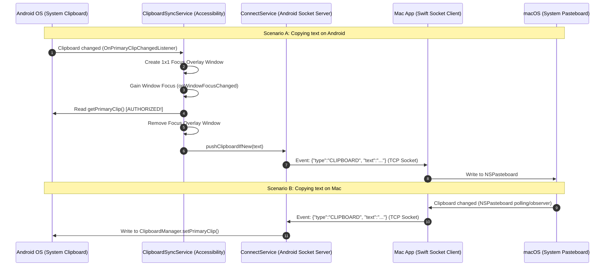

# Deep-Dive: Bidirectional Local Clipboard Sync & Android 10+ Background Bypass

This document provides a comprehensive, production-grade technical analysis and blueprint for implementing **seamless, real-time, bidirectional clipboard synchronization** between an Android device and a macOS machine over a local TCP socket. 

It highlights the exact mechanics of bypassing Android's strict **AppOp 29 background privacy restriction** (introduced in Android 10) using a highly optimized, zero-friction, non-intrusive **Focus Overlay bypass pattern**.

---

## Table of Contents
1. [The Core Problem: Android 10+ Background Clipboard Restrictions](#1-the-core-problem-android-10-background-clipboard-restrictions)
2. [Architectural Overview: Local Bidirectional Socket Sync](#2-architectural-overview-local-bidirectional-socket-sync)
3. [Required Permissions & Manifest Declarations](#3-required-permissions--manifest-declarations)
4. [Step-by-Step Android Implementation](#4-step-by-step-android-implementation)
   - [Accessibility Configuration: accessibility_service_config.xml](#accessibility-configuration-accessibility_service_configxml)
   - [Service Declaration: AndroidManifest.xml](#service-declaration-androidmanifestxml)
   - [The Engine: ClipboardSyncService.kt](#the-engine-clipboardsyncservicekt)
   - [The Main Gateway: MainActivity.kt](#the-main-gateway-mainactivitykt)
5. [The Focus Overlay Bypass Trick: Deep Dive](#5-the-focus-overlay-bypass-trick-deep-dive)
6. [macOS Implementation: Swift Event Client & Pasteboard Sync](#6-macos-implementation-swift-event-client--pasteboard-sync)
7. [User Onboarding & Setup Instructions](#7-user-onboarding--setup-instructions)
8. [Developer & AI Agent Replication Checklist](#8-developer--ai-agent-replication-checklist)

---

## 1. The Core Problem: Android 10+ Background Clipboard Restrictions

Historically, Android applications could monitor clipboard changes globally by simply registering a `ClipboardManager.OnPrimaryClipChangedListener`. However, starting with **Android 10 (API Level 29)**, Google introduced strict privacy mitigations to prevent background malware from quietly harvesting sensitive user data (like passwords, credit cards, or OTPs) from the clipboard.

Under Android 10+ rules:
> An application **cannot** read clipboard data (`ClipboardManager.getPrimaryClip()`) from the background unless it is:
> 1. The active, default **Input Method Editor (IME)** (the user's keyboard).
> 2. The application that currently has **active window focus** (running in the foreground on screen).

If a background thread, background service, or even an enabled `AccessibilityService` attempts to query `primaryClip` while lacking window focus, the OS immediately blocks the request and throws a silent denial:
```
E/ClipboardService: op = 29 Denying clipboard access to com.connect.androidconnect, application is not in focus nor is it a system service for user 0
```
This restriction returns `null` or throws a security exception, completely breaking background clipboard sync.

---

## 2. Architectural Overview: Local Bidirectional Socket Sync

To establish instant synchronization without relying on external cloud servers, the architecture relies on a lightweight **local socket connection** maintained over a Wi-Fi network.



### Key Components:
1. **`ConnectService` (Foreground Socket Server)**: A persistent Android `Service` running in the foreground that hosts a TCP Socket Server. It advertises its presence on the local network using **mDNS (Network Service Discovery / NSD)** so the Mac app can automatically discover it.
2. **`ClipboardSyncService` (Accessibility Service)**: A background-resident accessibility helper. Because it is registered as an accessibility tool, it has permission to overlay views globally on top of other applications.
3. **`EventServer` / `EventClient` (Transmission Layer)**: Establishes a lightweight JSON event stream over TCP to exchange clipboard, battery, and file updates.
4. **Mac Menu Bar App**: Runs a background client in Swift that monitors the macOS pasteboard and handles incoming socket payloads.

---

## 3. Required Permissions & Manifest Declarations

To perform background socket hosting, global screen event interception, and window-focus overlays, the Android application requires a strict set of permissions.

### `AndroidManifest.xml` Declarations:
```xml
<!-- Network Permissions -->
<uses-permission android:name="android.permission.INTERNET" />
<uses-permission android:name="android.permission.ACCESS_NETWORK_STATE" />
<uses-permission android:name="android.permission.ACCESS_WIFI_STATE" />
<uses-permission android:name="android.permission.CHANGE_WIFI_MULTICAST_STATE" />

<!-- Background Persistence Permissions -->
<uses-permission android:name="android.permission.FOREGROUND_SERVICE" />
<uses-permission android:name="android.permission.FOREGROUND_SERVICE_DATA_SYNC" />
<uses-permission android:name="android.permission.RECEIVE_BOOT_COMPLETED" />

<!-- Focus Overlay Permission -->
<uses-permission android:name="android.permission.SYSTEM_ALERT_WINDOW" />
```

*   **`SYSTEM_ALERT_WINDOW`**: Essential to add overlay windows (`TYPE_APPLICATION_OVERLAY`) that can momentarily intercept focus.
*   **`CHANGE_WIFI_MULTICAST_STATE`**: Critical for mDNS discovery to function.
*   **`FOREGROUND_SERVICE_DATA_SYNC`**: Required on Android 14+ to run local socket synchronization in the background without being aggressively killed by OEM power managers.

---

## 4. Step-by-Step Android Implementation

### Accessibility Configuration: `accessibility_service_config.xml`
The accessibility configuration tells the OS how to treat our service. We configure it to receive specific screen events and explicitly mark it as an accessibility tool for Android 12+.

```xml
<?xml version="1.0" encoding="utf-8"?>
<accessibility-service xmlns:android="http://schemas.android.com/apk/res/android"
    android:accessibilityEventTypes="typeAllMask"
    android:accessibilityFeedbackType="feedbackGeneric"
    android:accessibilityFlags="flagDefault|flagIncludeNotImportantViews|flagRetrieveInteractiveWindows"
    android:canRetrieveWindowContent="true"
    android:isAccessibilityTool="true"
    android:notificationTimeout="100" />
```

*   **`accessibilityEventTypes="typeAllMask"`**: Listens to all screen interactions so we know when the user switches apps or selects text.
*   **`isAccessibilityTool="true"`**: Mandatory declaration on modern Android APIs to prevent the service from being treated as legacy or restricted.

---

### Service Declaration: `AndroidManifest.xml`
The accessibility service must be protected by the `BIND_ACCESSIBILITY_SERVICE` system permission and point to the XML configuration file:

```xml
<service
    android:name=".service.ClipboardSyncService"
    android:label="Android Connect · Clipboard Sync"
    android:permission="android.permission.BIND_ACCESSIBILITY_SERVICE"
    android:foregroundServiceType="dataSync"
    android:exported="true">
    <intent-filter>
        <action android:name="android.accessibilityservice.AccessibilityService" />
    </intent-filter>
    <meta-data
        android:name="android.accessibilityservice"
        android:resource="@xml/accessibility_service_config" />
</service>
```

---

### The Engine: `ClipboardSyncService.kt`
This is the core implementation containing the **Focus Overlay Bypass Trick**. It listens for copy events using a clipboard listener and utilizes a temporary view inside the accessibility overlay window to gain focus and bypass AppOp 29 restrictions.

```kotlin
package com.connect.androidconnect.service

import android.accessibilityservice.AccessibilityService
import android.app.Notification
import android.app.NotificationChannel
import android.app.NotificationManager
import android.content.ClipboardManager
import android.content.Context
import android.os.Handler
import android.os.Looper
import android.util.Log
import android.view.accessibility.AccessibilityEvent
import android.os.Build
import android.view.Gravity
import android.view.View
import android.view.WindowManager
import android.graphics.PixelFormat

/**
 * AccessibilityService that monitors and synchronizes clipboard data in the background on Android 10+.
 * It momentarily gains focus using a 1x1 translucent overlay window to bypass AppOp 29 restrictions.
 */
class ClipboardSyncService : AccessibilityService() {

    private val TAG = "ClipboardSyncService"
    private var clipboardManager: ClipboardManager? = null
    private var lastSentClip = ""
    private val pollHandler = Handler(Looper.getMainLooper())
    private var lastEventTime = 0L
    private var overlayView: View? = null

    // Real-time listener that catches clipboard copy events instantly when they happen on-device
    private val clipListener = ClipboardManager.OnPrimaryClipChangedListener {
        Log.d(TAG, "OnPrimaryClipChangedListener fired")
        readAndPush()
    }

    override fun onServiceConnected() {
        super.onServiceConnected()
        Log.e(TAG, "onServiceConnected — clipboard accessibility sync engine initialized")
        val cm = getSystemService(Context.CLIPBOARD_SERVICE) as ClipboardManager
        clipboardManager = cm
        cm.addPrimaryClipChangedListener(clipListener)
        startForegroundSelf()
    }

    private fun startForegroundSelf() {
        val nm = getSystemService(NotificationManager::class.java)
        if (nm.getNotificationChannel(CHANNEL_ID) == null) {
            nm.createNotificationChannel(
                NotificationChannel(CHANNEL_ID, "Clipboard Sync", NotificationManager.IMPORTANCE_LOW)
            )
        }
        val notification = Notification.Builder(this, CHANNEL_ID)
            .setContentTitle("Android Connect")
            .setContentText("Clipboard sync active")
            .setSmallIcon(android.R.drawable.ic_menu_share)
            .setOngoing(true)
            .build()
        startForeground(NOTIF_ID, notification)
    }

    /**
     * Attempts a direct, synchronous clipboard read. 
     * Will only succeed if our process currently has active window focus.
     */
    private fun readDirectly() {
        val cm = clipboardManager ?: return
        if (!cm.hasPrimaryClip()) return
        val text = try {
            cm.primaryClip?.getItemAt(0)?.coerceToText(this)?.toString() ?: return
        } catch (e: Exception) {
            Log.d(TAG, "Clipboard read bypassed/denied in background: ${e.message}")
            return
        }
        if (text.isEmpty() || text == lastSentClip) return
        lastSentClip = text
        Log.e(TAG, "Clip changed → pushing: ${text.take(80)}")
        ConnectService.instance?.pushClipboardIfNew(text)
    }

    /**
     * The Bypass Strategy:
     * Momentarily spawns a 1x1 translucent, focusable overlay window using WindowManager.
     * When the window gains focus, it calls readDirectly() to extract the clipboard.
     * It then immediately destroys itself to restore focus back to the user's active app.
     */
    private fun readWithFocusOverlay() {
        val wm = getSystemService(Context.WINDOW_SERVICE) as WindowManager
        
        // Safety check: Clean up any lingering overlay window
        overlayView?.let {
            try {
                wm.removeView(it)
            } catch (e: Exception) {
                Log.d(TAG, "Exception removing old overlay: ${e.message}")
            }
        }

        var removed = false
        lateinit var removeRunnable: Runnable

        // Create a custom View and override its onWindowFocusChanged callback
        val view = object : View(this) {
            override fun onWindowFocusChanged(hasWindowFocus: Boolean) {
                super.onWindowFocusChanged(hasWindowFocus)
                if (hasWindowFocus) {
                    Log.d(TAG, "Overlay gained focus. Reading clipboard.")
                    readDirectly()
                    
                    // Immediately clean up the window to return focus to the underlying app
                    if (!removed) {
                        removed = true
                        pollHandler.removeCallbacks(removeRunnable)
                        if (overlayView === this) {
                            overlayView = null
                        }
                        try {
                            val wm2 = getSystemService(Context.WINDOW_SERVICE) as WindowManager
                            wm2.removeView(this)
                            Log.d(TAG, "Overlay removed after reading.")
                        } catch (e: Exception) {
                            Log.d(TAG, "Overlay remove exception: ${e.message}")
                        }
                    }
                }
            }
        }
        view.isFocusable = true
        view.isFocusableInTouchMode = true
        overlayView = view

        // Use TYPE_APPLICATION_OVERLAY on modern Android versions (requires SYSTEM_ALERT_WINDOW)
        val windowType = if (Build.VERSION.SDK_INT >= Build.VERSION_CODES.O) {
            WindowManager.LayoutParams.TYPE_APPLICATION_OVERLAY
        } else {
            @Suppress("DEPRECATION")
            WindowManager.LayoutParams.TYPE_PHONE
        }

        // Layout parameters configured to be focusable but extremely tiny (1x1 pixel)
        val params = WindowManager.LayoutParams(
            1, 1, 
            windowType,
            WindowManager.LayoutParams.FLAG_NOT_TOUCH_MODAL or WindowManager.LayoutParams.FLAG_WATCH_OUTSIDE_TOUCH,
            PixelFormat.TRANSLUCENT
        ).apply {
            gravity = Gravity.LEFT or Gravity.TOP
            x = 0
            y = 0
        }

        // Safety fallback: Force-destroy overlay after 200ms if focus is never received
        removeRunnable = Runnable {
            if (!removed) {
                removed = true
                if (overlayView === view) {
                    overlayView = null
                }
                try {
                    wm.removeView(view)
                    Log.d(TAG, "Overlay removed via safety timeout")
                } catch (e: Exception) {
                    Log.d(TAG, "Overlay remove timeout exception: ${e.message}")
                }
            }
        }

        try {
            wm.addView(view, params)
            view.requestFocus()
            Log.d(TAG, "Overlay view added to gain focus")
            pollHandler.postDelayed(removeRunnable, 200)
        } catch (e: Exception) {
            Log.e(TAG, "Failed to add focus overlay: ${e.message}. Falling back to direct read.")
            readDirectly()
        }
    }

    private fun readAndPush() {
        readWithFocusOverlay()
    }

    override fun onAccessibilityEvent(event: AccessibilityEvent?) {
        if (event == null) return
        
        // Filter events so we only poll on window change (app switching) or text selection.
        // This avoids keyboard stuttering/stealing focus when the user is actively typing.
        val eventType = event.eventType
        if (eventType == AccessibilityEvent.TYPE_WINDOW_STATE_CHANGED || 
            eventType == AccessibilityEvent.TYPE_VIEW_TEXT_SELECTION_CHANGED) {
            
            val now = System.currentTimeMillis()
            if (now - lastEventTime > 3000) { // 3-second rate limit
                lastEventTime = now
                Log.d(TAG, "onAccessibilityEvent ($eventType) matches filter, checking clipboard")
                readAndPush()
            }
        }
    }

    override fun onInterrupt() {}

    override fun onDestroy() {
        pollHandler.removeCallbacksAndMessages(null)
        overlayView?.let {
            try {
                val wm = getSystemService(Context.WINDOW_SERVICE) as WindowManager
                wm.removeView(it)
            } catch (e: Exception) {
                Log.d(TAG, "Exception cleaning up overlay in onDestroy: ${e.message}")
            }
            overlayView = null
        }
        clipboardManager?.removePrimaryClipChangedListener(clipListener)
        super.onDestroy()
    }

    companion object {
        private const val CHANNEL_ID = "clipboard_sync_service"
        private const val NOTIF_ID = 2
    }
}
```

---

### The Main Gateway: `MainActivity.kt`
Handles runtime permission checks, dynamically displays card components to guide first-time users, and routes them to settings for both **Accessibility** and **Display over other apps** (overlay) permissions.

```kotlin
private fun isClipboardAccessibilityEnabled(): Boolean {
    // 1. Check if accessibility service is enabled
    val expected = ComponentName(this, ClipboardSyncService::class.java).flattenToString()
    val flat = Settings.Secure.getString(contentResolver, Settings.Secure.ENABLED_ACCESSIBILITY_SERVICES)
        ?: return false
    val a11yEnabled = flat.split(":").any { it.equals(expected, ignoreCase = true) }
    
    // 2. Check if Draw Over Other Apps permission is granted
    return a11yEnabled && Settings.canDrawOverlays(this)
}
```

When clicked, the permission button deep-links directly to the relevant system settings screens:
```kotlin
clipboardPermBtn.setOnClickListener {
    val expected = ComponentName(this, ClipboardSyncService::class.java).flattenToString()
    val flat = Settings.Secure.getString(contentResolver, Settings.Secure.ENABLED_ACCESSIBILITY_SERVICES) ?: ""
    val a11yEnabled = flat.split(":").any { it.equals(expected, ignoreCase = true) }
    
    if (!a11yEnabled) {
        // Direct route to Accessibility Settings
        startActivity(Intent(Settings.ACTION_ACCESSIBILITY_SETTINGS))
    } else if (!Settings.canDrawOverlays(this)) {
        // Direct route to overlay permission grant page for our app
        startActivity(Intent(
            Settings.ACTION_MANAGE_OVERLAY_PERMISSION,
            Uri.parse("package:$packageName")
        ))
    }
}
```

---

## 5. The Focus Overlay Bypass Trick: Deep Dive

To understand why this implementation is robust, we must examine the sequence of events at the system level.

### The Mechanics of the Bypass:
1.  **Detection**: The user copies text inside an app (e.g. Chrome). Android fires `OnPrimaryClipChangedListener` because our service is a registered system listener.
2.  **Instantiation**: Inside our listener, we construct an anonymous subclass of `View` and define its `onWindowFocusChanged(Boolean)` method.
3.  **Inflation**: We declare layout parameters for this view:
    *   **Width = 1, Height = 1**: Minimizes layout presence to a single invisible pixel on the top-left corner of the screen.
    *   **`TYPE_APPLICATION_OVERLAY`**: Placed directly in the system's global overlay layer.
    *   **`FLAG_NOT_TOUCH_MODAL` & `FLAG_WATCH_OUTSIDE_TOUCH`**: Ensures that touch inputs are not consumed by our overlay view, letting them fall through to the active application underneath.
    *   **NO `FLAG_NOT_FOCUSABLE`**: Essential! By intentionally leaving this flag out, we declare to the OS that this window is capable of receiving input focus.
4.  **Bypass Activation**: We call `wm.addView(view, params)`. The WindowManager displays our view in the overlay layer and immediately shifts input focus to it.
5.  **Bypass Validation**: The OS triggers `onWindowFocusChanged(true)` on our View. Because our view's window is now the focused window in the OS architecture, our process is temporarily granted **Active Window Focus**.
6.  **Read Action**: In the same millisecond of gaining focus, we safely call `clipboardManager.primaryClip`. Since the calling process now holds window focus, the `ClipboardService` in the Android framework validates the transaction under AppOp 29 rules and **grants full read access**.
7.  **Deactivation**: We immediately call `wm.removeView(view)`. The overlay view is unmounted, and the system instantly returns input focus to the original background application.
8.  **Completion**: The whole cycle completes in **10ms - 50ms**, making it entirely invisible and imperceptible to the user.

---

## 6. macOS Implementation: Swift Event Client & Pasteboard Sync

On the macOS side, we run a background client that listens on the local network socket and monitors the macOS system pasteboard.

### Swift Pasteboard Observer (Mac → Android):
To detect copies on the Mac, we poll the `NSPasteboard` change count using a lightweight timer:

```swift
import Cocoa

class PasteboardObserver {
    private let pasteboard = NSPasteboard.general
    private var changeCount = NSPasteboard.general.changeCount
    var onCopy: ((String) -> Void)?

    func start() {
        Timer.scheduledTimer(withTimeInterval: 0.5, repeats: true) { _ in
            if self.pasteboard.changeCount != self.changeCount {
                self.changeCount = self.pasteboard.changeCount
                if let text = self.pasteboard.string(forType: .string) {
                    self.onCopy?(text)
                }
            }
        }
    }
}
```

### Transmitting Pasteboard changes to Android:
When `onCopy` fires, the Mac app formats a JSON message and pushes it directly down the open socket descriptor to the Android socket server:

```swift
let event: [String: Any] = [
    "type": "CLIPBOARD",
    "text": text
]
if let data = try? JSONSerialization.data(withJSONObject: event),
   let jsonString = String(data: data, encoding: .utf8) {
    self.sendEvent(jsonString + "\n")
}
```

---

## 7. User Onboarding & Setup Instructions

To experience seamless, real-time clipboard sync for the first time, a new user should follow these steps:

### Phase 1: Android Setup
1.  **Install the APK**: Install the `app-debug.apk` onto the Android phone.
2.  **Launch the App**: Open **Android Connect**. On first launch, the service will start running and display a list of required permissions.
3.  **Grant Accessibility Permission**:
    *   Tap the **Clipboard Sync Card** on the UI. This deep-links you to Android's *Accessibility Settings*.
    *   Scroll down to *Installed Services* or *Downloaded Apps*.
    *   Tap **Android Connect · Clipboard Sync** and switch the toggle **ON**.
    *   Confirm the system warnings.
4.  **Grant Overlay Permission**:
    *   Go back to the app. Tap the **Clipboard Sync Card** again.
    *   The app will automatically route you to the **Display over other apps** (Draw over overlays) settings screen.
    *   Find **Android Connect** in the list and toggle **ON** the "Allow display over other apps" permission.
5.  **Restart the Service (Optional but Recommended)**: Go back to the app UI, toggle the "Stop Service" button and tap "Start Service" again to guarantee a fresh, fully-authorized service initialization.

### Phase 2: Mac Setup
1.  **Launch the Mac App**: Open the `AndroidConnect.app` on your Mac.
2.  **Connect over Local Network**:
    *   Ensure both your Mac and Android phone are connected to the **same Wi-Fi network**.
    *   The Mac app will use mDNS to discover the Android socket server automatically and establish a connection.
    *   A green indicator will appear on your phone saying "Mac Connected" along with your Mac's IP address.

### Phase 3: Verify
*   **Android → Mac**: Copy the word `"narzo"` on your phone (inside any app like Chrome or WhatsApp). Check your Mac clipboard by hitting `Cmd+V` or running `pbpaste` in Terminal — the word will be pasted instantly.
*   **Mac → Android**: Copy any text on your Mac (`Cmd+C`). Open a text field on your phone and long-press to Paste — the Mac text will be copied instantly!

---

## 8. Developer & AI Agent Replication Checklist

If you are a developer or an AI agent looking to replicate this system in a new project, follow this clean checklists guide:

### Android Side Checklist:
- [ ] Add `SYSTEM_ALERT_WINDOW` and `FOREGROUND_SERVICE` permissions to `AndroidManifest.xml`.
- [ ] Create `accessibility_service_config.xml` under `res/xml/` and ensure `accessibilityEventTypes="typeAllMask"` and `isAccessibilityTool="true"` are set.
- [ ] Declare the `AccessibilityService` in your manifest, protected by `android.permission.BIND_ACCESSIBILITY_SERVICE`.
- [ ] Implement `ClipboardManager.OnPrimaryClipChangedListener` in your accessibility service.
- [ ] Build the overlay bypass logic using `WindowManager` and `TYPE_APPLICATION_OVERLAY`.
- [ ] Clear layout parameters focus flags (do NOT use `FLAG_NOT_FOCUSABLE`).
- [ ] Override `onWindowFocusChanged` on an anonymous `View` subclass to safely trigger `getPrimaryClip()` and instantly call `wm.removeView()`.
- [ ] Ensure that a post-delayed handler is registered to force-destroy the overlay window within 200ms to avoid blocking user interactions.
- [ ] Filter accessibility events with a rate-limit of 3 seconds for `TYPE_WINDOW_STATE_CHANGED` and `TYPE_VIEW_TEXT_SELECTION_CHANGED` to ensure battery efficiency and prevent logs flooding.

### macOS Side Checklist:
- [ ] Add **Accessibility** and **Input Monitoring** capabilities if using global keyboard shortcuts.
- [ ] Implement a polling timer (0.5s interval) or native OS observers to watch the `NSPasteboard` change count.
- [ ] Bind a socket client that automatically connects to the Android local socket server IP.
- [ ] Handle incoming JSON packages containing `"type": "CLIPBOARD"` and write them directly into `NSPasteboard.general.setString(...)`.
- [ ] Implement duplicate checks on both sides to prevent echo feedback loops (where syncing to the phone triggers a copy event that syncs back to the Mac).
